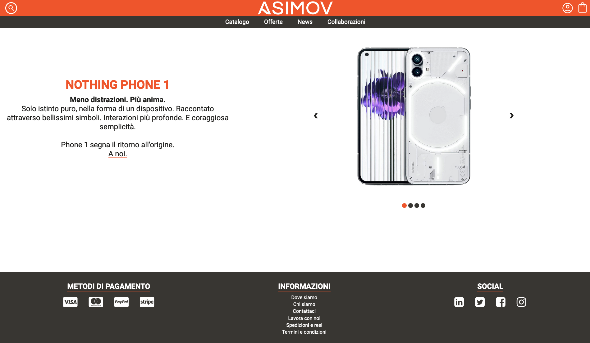
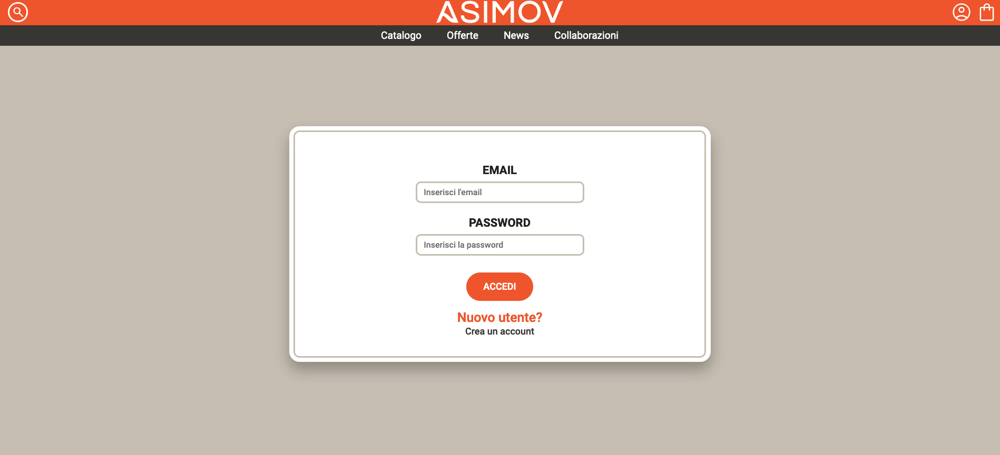
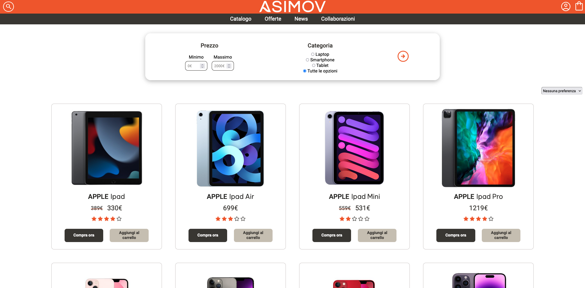

# Asimov
Asimov is a web application developed as part of the "Web Technologies and Software" course at the University of Salerno.
The project aims to provide an e-commerce platform for selling smartphones, tablets, and laptops.

## Screenshot
<p align="center">
    <strong> HOMEPAGE </strong>
</p>
<p align="center"> 
    
</p>

<p align="center">
    <strong> LOGIN/SIGNUP </strong>
</p>
<p align="center"> 
    
</p>

<p align="center">
    <strong> CATALOGO </strong>
</p>
<p align="center"> 
    
</p>

### Technologies ssed
- **Frontend**: HTML5, CSS3, JavaScript
- **Backend**: Java, JSP
- **Database**: MySQL
- **Altre tecnologie**: AJAX

## Info
This project was created for the course "Tecnologie Software per il Web" at the Università degli Studi di Salerno.

## Contribution
If you'd like to contribute to Bloky, please follow these steps:
- Fork the repository;
- Create a new branch (```git checkout -b feature/YourFeatureName```);
- Commit your changes (```git commit -m 'Add some feature'```);
- Push to the branch (```git push origin feature/YourFeatureName```);
- Open a pull request.

## License
This project is licensed under the MIT License. See the LICENSE file for details.
